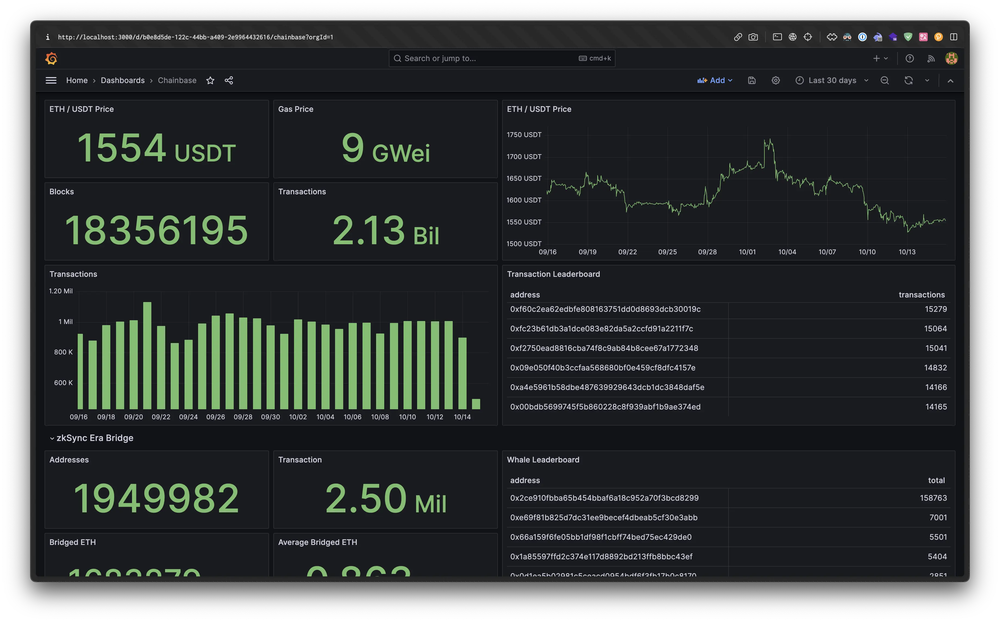
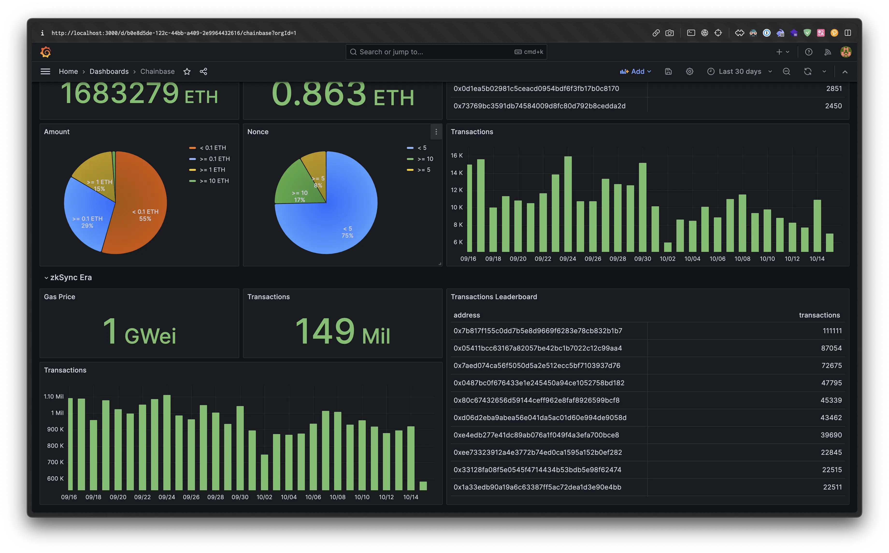
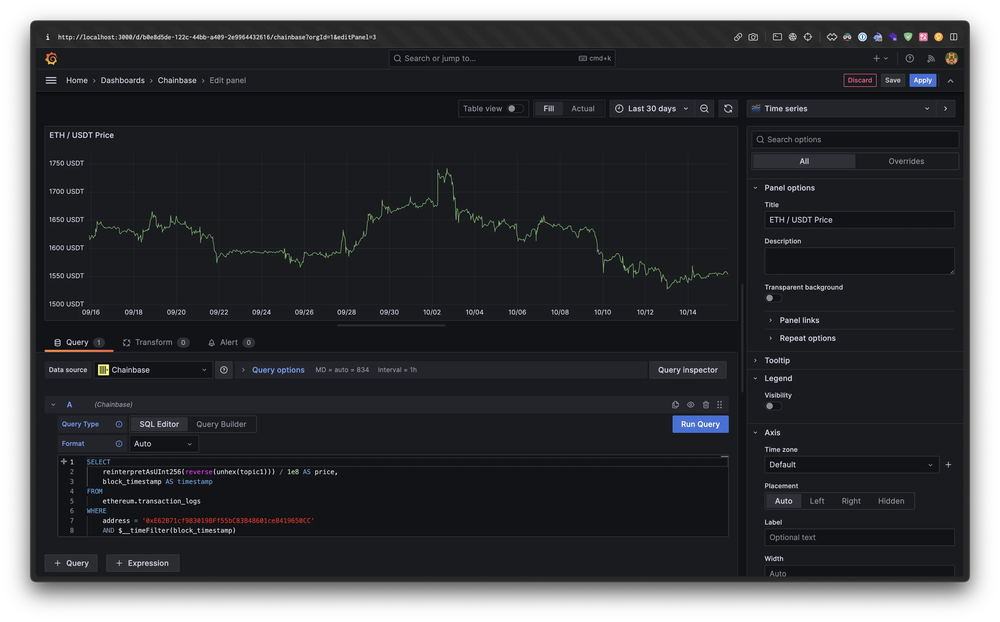

# Chainbase Connector

## Introduction
This connector can currently be used to connect Grafana's ClickHouse data source to ClickHouse's [HTTP Interface](https://clickhouse.com/docs/en/interfaces/http).

> [!WARNING]
> Currently only the common [Binary and Native data format](https://clickhouse.com/docs/en/integrations/data-formats/binary-native) field types are supported.

## Screenshots

## License

[Mozilla Public License Version 2.0](LICENSE)
